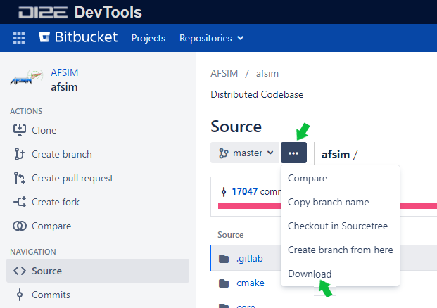
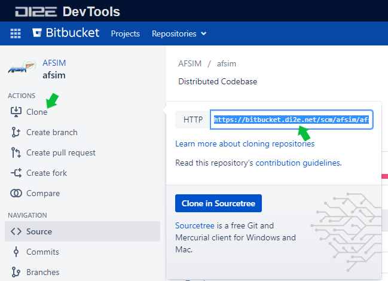

.. ****************************************************************************
.. CUI
..
.. The Advanced Framework for Simulation, Integration, and Modeling (AFSIM)
..
.. The use, dissemination or disclosure of data in this file is subject to
.. limitation or restriction. See accompanying README and LICENSE for details.
.. ****************************************************************************

Build Instructions
==================

.. contents::
   :local:

Overview
--------

This document describes how to build the AFSIM baseline applications, how directories may be structured, and how extensions and plug-ins may be included in the build.
It is intended for software developers and end-users needing to compile AFSIM.

Prerequisites
-------------

The following Operating Systems and Compilers are supported.

.. list-table:: **Operating System and Compiler**
          :class: header-text-left
             :class: align-top
          :widths: auto
          :header-rows: 1

          * - Operating System
            - Compiler
            - Version(s)
            - Architecture

          * - Windows 10
            - `Microsoft Visual Studio <https://www.visualstudio.com/>`_
            - 2015, 2017, or 2019
            - 64-bit

          * - Linux
            - `GCC <https://gcc.gnu.org/>`_
            - 4.8.5
            - 64-bit

.. Note:: The term *supported* infers AFSIM, as distributed, has been tested against these configurations. While AFSIM successfully compiles and runs in many configurations, only the listed configurations are fully tested by the development team.

.. list-table:: **Additional Tools**
          :class: header-text-left
          :header-rows: 1
          :widths: auto

          * - Tool
            - Version(s)
            - Required to
            - Notes

          * - `CMake <https://cmake.org/>`_
            - 3.7 or higher
            - Generate build system
            - For Visual Studio 2019, CMake 3.14 or higher is required.

          * - `Python <https://www.python.org/>`_
            - 3.x.x
            - Run automated tests and build Sphinx documentation
            -

          * - `Sphinx <http://www.sphinx-doc.org/>`_
            - 2.1.x or higher
            - Build Sphinx documentation
            - Requires MikTex on Windows and additional latex and image packages on Linux

              Sphinx 2.4.x or later is required to build LaTeX/PDF documentation

          * - `myst-parser <https://myst-parser.readthedocs.io/en/latest/>`_
            - 0.14.x or higher
            - Markdown support for Sphinx documentation
            -

          * - `MikTex <https://miktex.org/>`_
            - 2.9 or higher
            - Build Sphinx documentation
            - Windows only

          * - `Perl <https://www.perl.org/get.html>`_
            - 5.16.3
            - Build Sphinx documentation (LaTex/PDF)
            -

          * - `Doxygen <http://www.doxygen.org/>`_
            - 1.8.5 or higher
            - Build Doxygen documentation
            - Requires Graphviz to be installed

          * - `Graphviz <http://www.graphviz.org/>`_
            - 2.38 or higher
            - Build Doxygen documentation
            - Requires Doxygen to be installed

          * - `Gtest <https://github.com/google/googletest>`_
            - 1.10.0
            - Run Unit Tests
            -

          * - `GFortran <https://gcc.gnu.org/fortran/>`_

            -  Windows: 8.1.0

               Linux: 4.8.5

            - Build classified release
            -

          * - MESA Graphics Libraries
            - Latest
            - Build Graphical Applications
            - Debian: libglu1-mesa-dev and libgl1-mesa-dev

              RHEL: mesa-libGLU-devel and mesa-libGL-devel

          * - Linux JPEG Libraries
            - Latest
            - Build Graphical Applications
            - Debian: libjpeg62 and libjpeg62-dev

.. Tip:: Verify User and System Environment Variables are correct, including *PATH* settings, to avoid tool execution issues.

Obtaining Software
------------------

AFSIM source and application files may be obtained using the following methods:

#. Install AFSIM source and application files from an official distribution.
#. Download AFSIM source files from the official AFSIM repository.
#. Clone AFSIM source from the official AFSIM repository.

.. Note:: AFSIM software obtained from distribution files will include compiled AFSIM application executables in the release, such as Mission, Warlock, etc. Cloned repositories require a subsequent build to generate the target AFSIM applications.

Installing AFSIM and the AFSIM Source Code from a Distribution
""""""""""""""""""""""""""""""""""""""""""""""""""""""""""""""

The AFSIM Release Software may be obtained from the AFSIM Portal on `Confluence`_ by navigating to  the desired release and downloading the release package (zip, msi, tar.gz, deb, rpm).

.. _Confluence:
   https://confluence.di2e.net/x/mBqHG

.. Tip:: When a distribution package is extracted, a folder is created in the destination path specified for extraction (e.g. *afsim-x.y.z-win64*).  This folder may be renamed to a user specific convention and moved to the desired location prior to performing builds.

See the AFSIM :doc:`../user/installation_instructions` for additional information on obtaining AFSIM from a distribution.

The following is an example of the directory structure when installing AFSIM from a distribution file.

   .. parsed-literal::

      path/to/afsim/distribution
                 \|__ bin
                 \|__ demos
                 \|__ documentation
                 \|__ resources
                 \|__ swdev
                 \|  \|__ src
                 \|      .
                 \|      .
                 \|      CMakeLists.txt
                 \|      .
                 \|      .
                 \|__ tools
                 \|__ training

.. note:: The *swdev* directory contains the AFSIM source code when installing from a distribution file.  The *bin* directory contains the AFSIM application executables and libraries.

Downloading the AFSIM Source from a Remote Repository
"""""""""""""""""""""""""""""""""""""""""""""""""""""

The AFSIM source for Windows and Linux may be downloaded from the *afsim* repository on `Bitbucket`_ by selecting the ellipsis icon and the *Download* option from the drop-down menu as shown below:

.. _Bitbucket:
   https://bitbucket.di2e.net/projects/AFSIM/repos/afsim

Once the download is complete, the *.zip* file may be extracted in the root directory by right clicking the zip file and selecting the root directory as the destination.  An example of the resulting directory structure is shown below:

   .. parsed-literal::

      path/to/afsim
                 \|__ .gitlab
                 \|__ cmake
                 \|__ core
                 \|__ doc
                 \|__ mission
                 \|   .
                 \|   .
                 CMakeLists.txt
                 LICENSE.md
                 README.md
                 .
                 .

.. Note:: The Linux and Windows directory structures are the same.

Cloning AFSIM Source from a Remote Repository
"""""""""""""""""""""""""""""""""""""""""""""

AFSIM remote repositories may be cloned in both Windows and Linux using the "**git clone**" command, passing the URL of the remote repository, and optionally the desired name of the local repository.

The AFSIM project address for cloning may be found on the *afsim* repository on `Bitbucket`_ by selecting *Clone* from the ACTIONS menu and copying the highlighted text in the pop-up window as shown below:

The following *git clone* command example (Windows), will create the *afsim* sub-directory, and clone the *afsim* remote repository within:

   ``git clone https://bitbucket.di2e.net/scm/afsim/afsim.git afsim``

An example of the resulting directory structure is shown below:

   .. parsed-literal::

      path/to/afsim
                 \|__ .gitlab
                 \|__ cmake
                 \|__ core
                 \|__ doc
                 \|__ mission
                 \|   .
                 \|   .
                 CMakeLists.txt
                 LICENSE.md
                 README.md
                 .
                 .

.. tip:: Other AFSIM *repos* such as demos, tools, and training, may be cloned from Bitbucket in a similar manner.  These repos may be found here: https://bitbucket.di2e.net/projects/AFSIM.

Build Environment
-----------------

Directory Structure
"""""""""""""""""""

To maintain a clean source tree, *out-of-source* builds are preferred.
*Out-of-source* builds are accomplished by providing a separate, dedicated **BUILD** directory, outside of the source directories.
This provides the user the ability to delete the build tree without deleting source files, keeps the build artifacts generated by CMake out of the *source* directories, and protects source files from version control tools.

For this example, **BUILD** directories have been created outside of the source directories under ``path/to/afsim``:

.. list-table::
          :class: header-text-center
             :class: align-top
          :widths: auto
          :header-rows: 1

          * - Directory Structure from AFSIM Distribution File
            - Directory Structure from AFSIM Download or Clone

          * - ::

                path/to/afsim
                           \|__ bin
                           \|__ demos
                           \|__ documentation
                           \|__ resources
                           \|__ swdev
                           \|  \|__ **BUILD**
                           \|  \|__ src
                           \|      .
                           \|      .
                           \|      CMakeLists.txt
                           \|      .
                           \|      .
                           \|__ tools
                           \|__ training

            - ::

                path/to/afsim
                           \|__ .gitlab
                           \|__ **BUILD**
                           \|__ cmake
                           \|__ core
                           \|__ doc
                           \|__ mission
                           \|__ mystic
                           \|__ sensor_plot
                           \|__ tools
                           \|__ warlock
                           \|   .
                           \|   .
                           CMakeLists.txt
                           CMakeSettings.json
                           LICENSE.md
                           README.md
                           .
                           .

The top level source directories contain the main ``CMakeLists.txt`` files.  The **core** directory contains the source code for the simulation framework (WSF) and its extensions. The application directories (*mission, mystic, warlock, wizard*, etc.) contain the source and test code for the managed applications.

.. note:: The *swdev* directory contains the source code filesystem when installing AFSIM from a distribution file.  The *bin* directory contains the AFSIM application executables and libraries.

The *demos* folder contains all the *demos* and *scenarios* for the AFSIM applications. The *regression_tests* sub-directory under *demos* contains the ``<application-name>_list.txt`` files that specify the test files for `Running the Regression Tests`_.

   .. parsed-literal::

      demos
      \|__ acoustic
      \|   .
      \|   .
      \|__ regression_tests
      \|   mission_list.txt
      \|   sensor_plot_list.txt
      \|    .
      \|    .
      \|__ route_finder_demos
      \|__ satellite_demos
      \|   .
      \|   .

.. Note:: The regression test suite is not distributed with the AFSIM release and is available only when cloning or downloading the *demos* repo.

**Unit test** source files (C++) are located in *test* sub-directories under those modules or libraries that have unit test suites.

   .. parsed-literal::

      .
      .
      \|__ core
      \|__ doc
      \|__ mission
      \|__ tools
      \|  \|__ geodata
      \|      \|__ test
      \|        .
      \|        .
      \|  \|__ util
      \|      \|__ test
      \|        .
      \|        .
      \|__ wizard
      \|__ wsf_plugins
      .
      .

Including 3rd Party Libraries and Resources
'''''''''''''''''''''''''''''''''''''''''''

The *3rd_party* and *vtk_resources* artifacts may be downloaded from `Confluence`_ by navigating to the **Developer Resources** table for the desired release.

*3rd party libraries* and *resources* may be included in the AFSIM build by extracting the files in the AFSIM root directory (or other directory) and setting the **SWDEV_THIRD_PARTY_PACKAGE_SOURCES** and **VTK_RESOURCES_SOURCEDIR** in the CMake build options to the directory the files were downloaded in.  See `Configuring 3rd party libraries and resources`_ for additional information.

Including Extensions and Plug-ins
'''''''''''''''''''''''''''''''''

Extensions (also called optional projects) and plug-ins can be included in the AFSIM build by placing them in the AFSIM root directory (or other directory) and setting the **WSF_ADD_EXTENSION_PATH** in the CMake build options.  Setting the WSF_PLUGIN_BUILD CMake option to TRUE enables plugins in the build executables.  See `CMake Options`_ for additional information.

Extensions have a directory that collects all the files and directories that make up the extension. That main directory must contain a ``wsf_module`` file that CMake will use to include the extension in the AFSIM build.  The ``wsf_module`` filename has no extension and the file itself has no content.  This file exists with the plugin as an indication to CMake that the directory includes an extension.

It also includes the ``test_<application-name>`` directory that contains the ``test_*.txt`` files that will be run along with an application's auto tests.  See `Running the System Tests`_ for additional information.

Generating a Buildsystem
""""""""""""""""""""""""

CMake is used to generate the AFSIM buildsystem and provides both a command line and GUI interface for generating the buildsystem. Additional documentation for CMake can be found at https://cmake.org/documentation/.

CMake Command Line
''''''''''''''''''

One of the following CMake command signatures may be used to specify the source and build trees and generate a buildsystem:

``cmake [<options>] <path-to-source>``

   Uses the current working directory as the build tree, and ``<path-to-source>`` as the source tree containing the top-level AFSIM ``CMakeLists.txt`` file. The specified path may be absolute or relative to the current working directory. See examples below:

.. list-table::
          :class: header-text-center
             :class: align-top
          :widths: auto
          :header-rows: 1

          * - CMake Command Line Using Path to "Source"

          * - .. list-table::
                 :class: cell-text-left
                    :class: align-top
                 :widths: auto
                 :header-rows: 0

                 * - **AFSIM Distribution File**
                   - **AFSIM Download or Clone**

                 * - ``path/to/afsim> cd BUILD``

                     ``path/to/afsim/swdev/BUILD> cmake ../src``

                   - ``path/to/afsim> cd BUILD``

                     ``path/to/afsim/BUILD> cmake ..``

``cmake [<options>] <path-to-existing-build>``

   Uses ``<path-to-existing-build>`` as the build tree, and loads the path to the source tree from its ``CMakeCache.txt`` file (which must have been generated by a previous run of CMake). The specified path may be absolute or relative to the current working directory. For example:

.. list-table::
          :class: header-text-center
             :class: align-top
          :widths: auto
          :header-rows: 1

          * - CMake Command Line Using Path to "BUILD"

          * - .. list-table::
                 :class: cell-text-left
                    :class: align-top
                 :widths: auto
                 :header-rows: 0

                 * - **AFSIM Distribution File**
                   - **AFSIM Download or Clone**

                 * - ``path/to/afsim/swdev> cd BUILD``

                     ``path/to/afsim/swdev/BUILD> cmake .``

                   - ``path/to/afsim> cd BUILD``

                     ``path/to/afsim/BUILD> cmake .``

``cmake [<options>] -S <path-to-source> -B <path-to-build>``

   Uses ``<path-to-source>`` as the source tree and ``<path-to-build>`` as the build tree, containing the top-level AFSIM ``CMakeLists.txt`` file. The specified paths may be absolute or relative to the current working directory. The build tree will be created automatically if it does not already exist. For example:

.. list-table::
          :class: header-text-center
             :class: align-top
          :widths: auto
          :header-rows: 1

          * - CMake Command Line Using Paths to "Source" and "BUILD"

          * - .. list-table::
                 :class: cell-text-left
                    :class: align-top
                 :widths: auto
                 :header-rows: 0

                 * - **AFSIM Distribution File**
                   - **AFSIM Download or Clone**

                 * - ``path/to/afsim/swdev> cmake -S ./src -B ./BUILD``

                   - ``path/to/afsim> cmake -S . -B ./BUILD``

.. Note:: See `CMake Options`_ for a list of commonly used options.

CMake GUI
'''''''''

Launch the cmake-gui application (or cmake3-gui on Linux which supports the same `command line interface <CMake Command Line_>`_ as ``cmake``) to specify paths to source and build directories. If no arguments are given, these paths may be specified using the following steps:

#. In the **Where is the source code:** field, enter the path to the source tree containing the top-level AFSIM ``CMakeLists.txt`` file, e.g. ``<path/to/afsim>/swdev/src``. On supported windowing systems, you may also drag and drop the ``CMakeLists.txt`` file into the CMake GUI.
#. In the **Where to build the binaries:** field, enter the path to the build directory, e.g. ``<path/to/afsim>/swdev/BUILD``. You will be prompted to create this directory if it does not already exist. On supported windowing systems, you may also drag and drop a previously generated ``CMakeCache.txt`` file from an existing build into the CMake GUI.
#. Make changes as necessary to the configuration `options  <CMake Options_>`_ and then select the *Configure* button.

   .. note:: If this is a new build (i.e. no CMake cache), you will have to specify the *generator* for the project (e.g. Visual Studio), and *optional platform for generator* (e.g. x64).

#. Once the Configure step is complete, select the *Generate* button to generate the buildsystem.
#. If using an IDE generator, such as Visual Studio, you may select the *Open Project* button to open the project file.

CMake Options
'''''''''''''

Options can be set in the CMake GUI or passed as command line arguments using ``-D<var>[:<type>]=<value>``. The following variables are the most commonly used in modifying configurations:

   **BUILD_WITH_<module>** : BOOL
      Enables or disables each optional module (library extension or application).

   **BUILD_MYSTIC_PLUGIN_<PluginName>** : BOOL
      Enables or disables each Mystic plugin.

   **BUILD_WARLOCK_PLUGIN_<PluginName>** : BOOL
      Enables or disables each Warlock plugin.

   **BUILD_WIZARD_PLUGIN_<PluginName>** : BOOL
      Enables or disables each Wizard plugin.

   **BUILD_WKF_PLUGIN_<PluginName>** : BOOL
      Enables or disables each WKF plugin, which is loaded by multiple GUI applications.

   **CMAKE_BUILD_TYPE** : STRING
      Specifies the build type on single-configuration generators, such as Makefile Generators and Ninja, as opposed to multi-configuration generators, such as Microsoft Visual Studio. Possible values include ``Debug`` and ``Release`` (default).

   **CMAKE_INSTALL_PREFIX** : PATH
      Specifies the install directory when ``make install`` is invoked or the ``INSTALL`` target is built. Default is ``${CMAKE_BINARY_DIR}/wsf_install``.

   **CMAKE_UNITY_BUILD** : BOOL
      Enables or disables `CMake unity build <https://cmake.org/cmake/help/latest/variable/CMAKE_UNITY_BUILD.html>`_ support (available in CMake 3.16 and later).
      This feature "enables batch compilation of multiple sources within each target", resulting in significantly improved build times.
      Exact results will vary based on CPU, I/O subsystem, operating system, and compiler.
      Observed results with AFSIM generally show wall clock time improvements of at least 3x for clean builds.

   **PROMOTE_HARDWARE_EXCEPTIONS** : BOOL (Advanced)
      When set, ``ut::PromoteHardwareExceptions(true)`` allows hardware exceptions, such as divide-by-zero and access-violation to be promoted to ``ut::HardwareException``.
      On Windows, the function must be called on each thread individually.
      When the CMake flag is not set, the function is still callable but does nothing.

      Marked as *advanced* and will only be seen in the CMake GUI if the "Advanced" box is checked.

   .. _WSF_ADD_EXTENSION_PATH:

   **WSF_ADD_EXTENSION_PATH** : PATH
      Define additional search paths for extensions and plugins. Multiple paths may be specified with a ``;``-separated list.

   **WSF_PLUGIN_BUILD** : BOOL
      Builds shared object or DLL libraries instead of static libraries and enables plugins in the resulting executables. Default is TRUE.

   **WSF_INSTALL_SOURCE** : BOOL
      Enables or disables the installation of source files. Default is FALSE.

   **WSF_INSTALL_DOXYGEN** : BOOL
      Enables or disables the installation of Doxygen directory and sub-directories, if DOXYGEN target was built. Default is FALSE.

   **WSF_INSTALL_DOCUMENTATION** : BOOL
      Enables or disables the installation of documentation directory and sub-directories, if DOCUMENTATION target was built. Default is FALSE.

   **WSF_INSTALL_DEMOS** : BOOL
      Enables or disables the installation of demos directory and sub-directories. Default is FALSE.

   **WSF_INSTALL_SCENARIOS** : BOOL
      Enables or disables the installation of scenarios directory and sub-directories. Default is FALSE.

   **WSF_INSTALL_TOOLS** : BOOL
      Enables or disables the installation of tools directory and sub-directories. Default is FALSE.

   **WSF_INSTALL_TRAINING** : BOOL
      Enables or disables the installation of training directory and sub-directories. Default is FALSE.

   **WSF_INSTALL_DEPENDENCIES** : BOOL
      Enables or disables the installation of dependencies, e.g. MSVC runtimes, MESA GL libraries, etc. Default is FALSE.

Configuring 3rd party libraries and resources
'''''''''''''''''''''''''''''''''''''''''''''

Several options are available for configuring the 3rd party and resource dependencies. These dependencies are required for creating unit test targets using GTest, and for building the GUI applications. In the default configuration, CMake will look for 3rd party packages in ``${CMAKE_SOURCE_DIR}/../dependencies/3rd_party`` and the resources archive in ``${CMAKE_SOURCE_DIR}/../dependencies/resources``.

   **SWDEV_THIRD_PARTY_ROOT** : PATH
      The directory into which 3rd party packages will be extracted, or existing directory containing unpacked libraries. If not specified, CMake will attempt to detect an existing 3rd_party directory defined by the environment variable ``SWDEV_THIRD_PARTY_PATH``, or contained within or parallel to the source tree. If a 3rd_party directory is not detected in any of these locations, one will be created in the default location ``${CMAKE_BINARY_DIR}/3rd_party``.

   **SWDEV_THIRD_PARTY_PACKAGE_SOURCES** : PATH
      The source directory containing the 3rd party packages in tar.gz, tar, or zip format. Multiple search paths may be specified in a ``;``-separated list. If not specified, the default location is ``${CMAKE_SOURCE_DIR}/../dependencies/3rd_party``.

   **VTK_DEV_RESOURCES_PATH** : PATH
      The directory into which the resources archive will be extracted, or existing directory containing unpacked resource contents. Default location is ``${CMAKE_SOURCE_DIR}/../resources``.

   **VTK_RESOURCES_SOURCEDIR** : PATH
      The source directory containing the resources archive or externally managed unpacked resources. If not specified, the default location is ``${CMAKE_SOURCE_DIR}/../dependencies/resources``, unless **VTK_RESOURCES_SEARCH_PATH** is defined.

   .. note::
      The following variables are marked as *advanced* and will only be seen in the CMake GUI if the "Advanced" box is checked.

   **VTK_RESOURCES_SEARCH_PATH** : PATH (Advanced)
      As an alternative to **VTK_RESOURCES_SOURCEDIR**, define an initial search path for resources in a ``;``-separated list. Provides a hook for a developer or build system to specify alternate layouts without requiring source modification. The first valid directory discovered will be set as **VTK_RESOURCES_SOURCEDIR** (and cached for subsequent executions).

   **VTK_RESOURCES_ARCHIVE_FILENAME** : STRING (Advanced)
      The file name of the resources archive to extract. Default is ``vtk_resources-<version>-noarch.tar.gz``.

   **VTK_RESOURCES_CONTINUEIFMISSING** : BOOL (Advanced)
      Specifies whether CMake should warn and continue generating if required resources are not found. If false (the default), an error is produced, which will continue processing but skip generation.

Building the Standard AFSIM applications
----------------------------------------

To build one or more of the standard :ref:`applications<baseline_execs>` (i.e. :doc:`mission <../mission>`, etc.):

Windows
"""""""

CMake Targets
'''''''''''''

CMake generates multiple targets, including one for each executable and library.

The following CMake pre-defined targets are available:

   **ALL_BUILD**
      Builds all application(s) and libraries.

   **INSTALL**
      Generates an installation directory installing all items defined in the ``CMakelists.txt`` files.  See `Building the Install Target`_ for additional detail.

   **INSTALL_RUNTIME_ONLY**
      Generates an installation directory with only the runtime components (e.g. libraries, plugins, executables, grammar).  This may be used to generate the  minimum set of components required to run AFSIM, reducing installation times by not installing documentation, demos, etc.

   **PACKAGE**
      Creates a package file for distribution using the CPack generator specified in the CMake options: ``CPACK_BINARY_ZIP`` for a *zip* file or ``CPACK_BINARY_WIX`` for *msi* installer (requires WiX).

   **RUN_TESTS**
      Run all unit tests defined in the projects. Requires `gtest <https://github.com/google/googletest>`_ to be installed.

   **ZERO_CHECK**
      Automatically generated by CMake for Visual Studio integration, ignore.

The following custom targets are available:

   **<application-name>_AUTO_TEST**
      Run all tests against the <application-name> application.

   **<application-name>_REGRESSION_TEST**
      Run regression output for demos and scenarios against the <application-name> application.

   **DOCUMENTATION**
      Generates the documentation inside the **BUILD** directory in a folder called *documentation* for installation.  See `Building the Documentation Target`_ for additional detail.

   **DOXYGEN**
       Generates the Doxygen (code) documentation inside the **BUILD** directory in a folder called *doxygen* for installation.

Open the ``afsim.sln`` file from the **BUILD** directory with Visual Studio.

Upon inspection, the generated solution will contain multiple projects, some of which are source groups for multiple projects or type classes of projects. The **applications** source folder in Visual Studio contains all the applications that are being built in the solution.

Open the 'Configuration Manager' (**Build -> Configuration Manager**) or use the **Standard** toolbar (**View -> Toolbars -> Standard**) and select the desired **Active solution configuration**.
   * Select *INSTALL* in the Solution Explorer
   * Select *Release* for Solution Configuration (unless building a debug version)
   * Start the build

Linux
"""""

From the **BUILD** directory run::

   make <make-options> <make-targets>

Make Targets
''''''''''''

The following CMake pre-defined targets are available:

   **all**
      Builds all application(s) and libraries. This is the default target if none is specified.

   **install**
      Builds and installs artifacts to ``CMAKE_INSTALL_PREFIX`` (default is *BUILD/wsf_install*).

   **clean**
      Removes all created build products (debug and optimized versions of object files, libraries and executables).

   **package**
      Creates a package file for distribution using the appropriate CPack generator (deb, rpm, or tar.gz)

   **test**
      Run all unit tests defined in the projects. Requires `gtest <https://github.com/google/googletest>`_ to be installed.

The following custom targets are available:

   **<application-name>_AUTO_TEST**
      Run all tests against the <application-name> application.

   **<application-name>_AUTO_TEST_VALGRIND**
      Run all tests against the <application-name> application using valgrind outputting *xml* files for parsing.

   **<application-name>_REGRESSION_TEST**
      Run regression output for demos and scenarios against the <application-name> application.

   **DOCUMENTATION**
      Generates the documentation inside the **BUILD** directory in a folder called documentation for installation.  See `Building the Documentation Target`_ for additional detail.

   **DOXYGEN**
      Generates the Doxygen (code) documentation inside the **BUILD** directory in a folder called doxygen for installation.

Make Options
''''''''''''

<make-options> can be any valid make option, but the following two are of particular interest:

   **-j [jobs]**
       Specifies the number of jobs (commands) to run simultaneously. If the '-j' option is given without an argument, make will not limit the number of jobs that can run simultaneously. '-j8' is a good compromise if one does not wish to monopolize the system.

   **VERBOSE=1**
       CMake hides many of the details when calling the compiler and linker, making it difficult to debug build problems. This command forces all commands run by make to be output to STDOUT.

Building the Install Target
---------------------------

Users may build with the **INSTALL** target which creates a new *install* directory at ``CMAKE_INSTALL_PREFIX`` and pulls in all previously built applications, libraries, and plugins into the new directory.

.. note:: Any documentation artifacts needing to be part of the *install* must be generated before running the install target.

For Windows, the **Release** configuration must be selected in the Configuration Manager prior to running the **INSTALL** target.

For Linux, the **CMAKE_BUILD_TYPE** option must be set to *Release* prior to running the **install** target.

The following is an example of the *install* directory:

   .. parsed-literal::

      path/to/afsim/install
                 \|__ bin
                 \|  \|__ grammar
                 \|  \|__ lib
                 \|  \|__ mission_plugins
                 \|  .
                 \|  .
                 \|  dis.dll
                 \|  .
                 \|  .
                 \|__ resources
                 \|  \|__ data
                 \|  \|__ maps
                 \|  \|__ models
                 \|  \|__ shaders

Building the Documentation Target
---------------------------------

Details for building **Documentation** may be found in :doc:`documentation_generation`.

.. tip:: A *full* build is not a required prerequisite for building documentation.  Building the **DOCUMENTATION** target is sufficient to generate documentation.

Running the System Tests
------------------------

The system tests ensure that AFSIM (specifically the *core* application **mission**) is working correctly. AFSIM extensions and plugins can also have tests for their capability by having ``test_*.txt`` files on the following path:

::

   path/to/afsim/extension_name/wsf_<extension_name>/test_mission

The output for a successful test will be::

   -TEST- Using <path-to>/mission_<suffix>.exe
   Running ### tests
   Tests Complete in #.# s
   ---------------------------------------------------
   ### tests passed
   -PASS- No errors detected

Windows
"""""""

Build the **<application-name>_AUTO_TEST** project from Visual Studio.

.. note::
   **ALL_BUILD** target must be ran prior to target **<application-name>_AUTO_TEST** on plug-in build in order to properly install plug-ins in the proper locations for auto testing.

Linux
"""""

From the **BUILD** directory run::

   make <application-name>_AUTO_TEST

.. note::
   make command must be ran prior to make **<application-name>_AUTO_TEST** on plug-in build in order to properly install plug-ins in the proper locations for auto testing.

Running the Regression Tests
----------------------------

The regression tests ensure that AFSIM operations (specifically the core applications 'mission, sensor_plot, etc.') are working properly with all demos and scenarios as compared to a gold standard output. The demos and scenarios directory structure contains a directory called ``regression_tests`` with a file called ``<application-name>_list.txt``. This file contains the list of demos and scenarios to run against the application and collect output for comparison to gold standard output for that demo or scenario. All test output is placed in the BUILD directory under a folder called regression. This folder contains the demo and scenario output events along with application output listing for comparison to archived gold standard output.

::

   path/to/demos/scenarios/regression_tests/<application-name>_list.txt

The output for a successful test will be::

   -REGRESSION TEST- Using <path/to>/mission_<suffix>.exe
   Running ### tests
   Tests Complete in #.# s
   ---------------------------------------------------
   .
   .
   .
   ### tests passed
   -PASS- No errors detected

Regression output for each demo or scenario is placed in the following directory::

  <build-directory>/regression/<demo/scenario/directory-name>

Windows
"""""""

Build the **<application-name>_REGRESSION_TEST** project from Visual Studio.

.. note::
   The **ALL_BUILD** target must be built prior to building target: **<application-name>_REGRESSION_TEST** on plug-in build in order properly install plug-ins in the proper locations for regression testing.

Linux
"""""

From the **BUILD** directory run::

   make <application-name>_REGRESSION_TEST

.. note::
   The *make* command must be ran prior to *make* **<application-name>_REGRESSION_TEST** on plug-in build in order to properly install plug-ins in the proper locations for regression testing.

Troubleshooting
===============

The following troubleshooting tips may be used when encountering build problems:

#. Verify the build tools are the correct *version* according to the `Prerequisites`_
#. Remove the existing **BUILD** directory and re-build the AFSIM target.
#. Ensure the build environment has the correct paths or remote address for 3rd_party libraries and resources.
#. Build with the *Install* target when built applications do not run due to missing libraries. Typically this happens when applications have been compiled but not installed.
