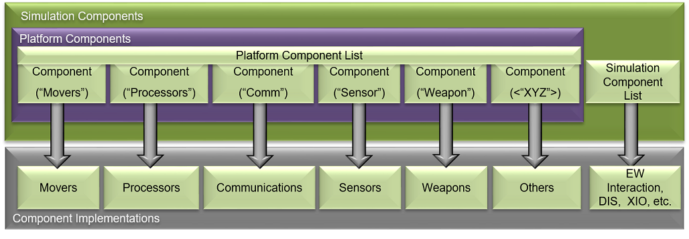
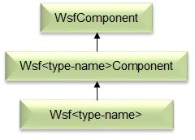
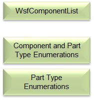

.. ****************************************************************************
.. CUI
..
.. The Advanced Framework for Simulation, Integration, and Modeling (AFSIM)
..
.. The use, dissemination or disclosure of data in this file is subject to
.. limitation or restriction. See accompanying README and LICENSE for details.
.. ****************************************************************************

*****************
Integration Guide
*****************

.. contents:: Table of Contents
   :local:
   :depth: 4

Introduction
============

This document describes a limited number of methods in which to extend and integrate new capabilities into the AFSIM. Multiple methods are allowed and described, as well as, requirements to allow introduction of an integration into a shareable resource within the AFSIM community standards and guidelines.

Overview
========

Core Executables
----------------

AFSIM-based executables generally consist of a single AFSIM "Application". This application maintains script types, extension and plug-in manager and application configuration data. The application is composed of one or more scenarios that own type factories and lists, user input, and scripts. The scenario is composed of one or more simulations, depending on the application. The simulation contains the type instances, interfaces (e.g. DIS, XIO, observer, terrain) and run-time data to include event management and threading.

.. image:: ../images/AFSIM_Application.png

Core Architecture
-----------------

AFSIM's object-oriented C++ based architecture provides an extensible and modular architecture to allow for inclusion of many additional capabilities to be easily integrated. AFSIM allows new component models (e.g. sensors, communications, movers, etc.), as well as completely new component types to be inserted and utilized in the framework. Extensions and plug-ins are the primary mechanisms by which the framework is extended to integrate new platform component models, new and extended platform capabilities, and new and extended simulation services.   The plug-in capability is a form of extension that allows one to add capabilities without re-compiling the core AFSIM code. Use of plug-ins allows for easier distribution of extended capabilities and provide the ability to choose which extended capabilities to use for a given analysis. The following figure shows AFSIM primary framework components and services that are provided and may be extended.

.. image:: ../images/AFSIM_Architecture.png

.. note::
   Doxygen software documentation is provided with the AFSIM release and may be built by developers via the `Doxygen`_ instructions.

Component Based Architecture
----------------------------

AFSIM's core architecture is a Component Based Architecture (CBA) allowing for many capabilities to be included via components and managed through component lists. This CBA is provided through C++'s Object-Oriented principles of encapsulation, inheritance, templating and polymorphism coupled with components list as further described below.

AFSIM's CBA allows for components and component lists at multiple levels in the framework, to include the application, scenario, simulation and platform with some inclusion into other areas such as subsystems. At the simulation and platform level component types are accessed by name or role. This access enables component type addition or removal from the simulations and platforms in a common manner through the component lists.

The component (i.e. *WsfComponent*) is the basic element that is derived from the hierarchy when creating new types or type templates for specialization. The base WsfComponent does not contain any member variables, so any functions require implementations in derived classes through the Wsf<type-name>Component.

The WsfComponent defines the following "primary" framework methods, many of which are pure virtual requiring implementation by a derived class: *CloneComponent*, *ProcessInput*, *PreInput*, *PreInitialize*, *Initialize*, *Initialize2*, *<Get/Set>ComponentName*, *<Get/Set>ComponentRole*, *InitializationOrder*, *QueryInterface* and *GetComponentInitializationOrder*.

The *QueryInterfaceMethod* is a required virtual function that allows for roles to be queried and requires *GetComponentRoles* to also be defined. Roles generally define services or other types on simulation component lists. Roles generally define types on platform components list e.g. sensors, comms, movers, processors, etc. Furthermore, component role enumerations are defined for each component and part type at a global and sometimes local level to support FindComponentByRole functionality in the component lists. Each project that requires additional roles adds to the global component roles enumerations within its own project. This addition of roles in a global context does require de-confliction amongst the multiple projects adding roles in a global context.

Component lists, along with type enumerations, provide methods to maintain and manage components. The WsfComponentList defines the following framework methods, many of which are pure virtual requiring implementation by the derived class.

Primary methods are available to allow for adding/deleting components, iterating components in the list, finding components by name or role and callbacks related to added/deleted.

CBA Implementations
^^^^^^^^^^^^^^^^^^^

Platform CBA Implementation
***************************

   The WsfPlatform (a.k.a platform) is a component itself and has an attached component lists to allow for inclusion of components to include sensors, comm, processors, movers, etc. via attached to the platform.

   .. image:: ../images/wsf_platform_component_hierachy.png

   WsfPlatform derives from WsfComponent (Template class), WsfComponentList (Template class) and WsfObject/WsfUniqueId classes. This derivation allows for direct access to WsfComponentList functions and the ability for a Platform to be a component of another platform, implementing a composition design pattern.

Example Component Implementation
********************************

   WsfSensor inherits WsfComponent through WsfPlatformPart which provides Member Variables and Implements Component-Related Virtual Functions in WsfSensor. Implementation is Similar for WsfProcessor, WsfComm WsfMover, etc.

   .. image:: ../images/wsf_sensor_component_example.png

   Declarations:

      .. code-block:: C++

         WSF_DECLARE_COMPONENT_ROLE_TYPE(WsfSensor, cWSF_COMPONENT_SENSOR)

   Functions:

      .. code-block:: C++

         WsfComponent* CloneComponent()
         WsfStringId GetComponentName()
         virtual void* QueryInterface(int aRole);
         virtual const int* GetComponentRoles();
         PreInitialize(...), Initialize(...), Initialize2(...) and ProcessInput(...)

   Example Sensor Role Implementation:

      .. code-block:: C++

         // ================================================================================================
         const int* WsfSensor::GetComponentRoles() const
         {
            static const int roles[] = { cWSF_COMPONENT_SENSOR, cWSF_COMPONENT_ARTICULATED_PART, cWSF_COMPONENT_PLATFORM_PART,
                                         cWSF_COMPONENT_NULL
                                       };
            return roles;
         }

         // ================================================================================================
         void* WsfSensor::QueryInterface(int aRole)
         {
            if (aRole == cWSF_COMPONENT_SENSOR) { return this; }
            if (aRole == cWSF_COMPONENT_ARTICULATED_PART) { return (WsfArticulatedPart*)this; }
            if (aRole == cWSF_COMPONENT_PLATFORM_PART) { return (WsfPlatformPart*)this; }
            return nullptr;
         }

Plug-In Management
------------------

AFSIM's plug-in system allows customization through dynamically loaded plug-ins, which provides similar level of flexibility as source code modifications. The use of plug-ins eliminates the need to distribute framework source code and updated core executables or libraries. Furthermore, plug-ins are easy to share, load and unload by the end user.

The AFSIM plug-in management offers the ability to version with major and minor descriptors, searches path defined by WSF_PLUGIN_PATH environment variable or uses *../<application>_plugin* or *../wsf_plugins* directory . Plug-in management also performs OS, compiler check and build type on the plug-in before registering it to ensure compatibility.

Extensions and Extension Types
------------------------------

Extensions for application, scenario, and simulations provide the flexibility to extend capability at each of these levels.

Application Extensions
^^^^^^^^^^^^^^^^^^^^^^

* Are extensions to the application singleton or instance and are owned by the application.
* Modify or represent the optional capabilities of the application.
* Maintain script types and plug-in management.
* May be used to add functionality to a scenario or simulations.

Scenario Extensions
^^^^^^^^^^^^^^^^^^^

* Are extensions to the scenario and are owned by the scenario
* Own type factories and lists, user input, and scripts
* Allow input to be read, i.e. ProcessInput(...) implementation.

Simulation Extensions
^^^^^^^^^^^^^^^^^^^^^

* Are extensions to the simulation and are owned by the simulation.
* Provide specific capabilities, e.g. interfaces, output, observers and other services.

AFSIM Build System
------------------

See :doc:`Building WSF Applications <build_instructions>` for more information on AFSIM's build system using CMake.

Optional Projects
^^^^^^^^^^^^^^^^^

:doc:`Building WSF Applications <build_instructions>` outlines the setup and necessary files to create an optional AFSIM project and have the top-level CMakeLists.txt file include the project. Additional the `Integration Methods`_ section outlines the different files and settings within these files necessary to include the project into the AFSIM build system in the proper integration method chosen by the developer.

Integration Methods
===================

Three integration methods are provided for in AFSIM for any extensions or models, direct, project and plug-in. Each of these methods allow for:

* one or more extension types to be integrated.
* varying integration methods and inclusion.
* different delivery methods of the extension(s).

These methods are further defined below as to their method, implementation, delivery and any other unique aspects.

Direct
------

Direct integration uses an existing project or plug-in to extend the capability via a new type definition or additional extension type addition. Generally, extensions already exist in the project and this method is used for adding in additional model type definitions or further extending an existing extension.

As a primary example is the addition of a new type or additional base type into an existing framework project. In this case the new type would be added to a new or existing type list through the projects interface, similar to:

Project
-------

Project method is one of the most common methods for extending the capabilities in AFSIM. This method may also be followed to integrate via plug-in method as described in the next section. This method involves creating an additional project that can be integrated into any of the extension types to extend AFSIM capabilities.

Directory Structure
^^^^^^^^^^^^^^^^^^^

   Project directory structure in AFSIM consists of multiple directories and files to support the addition of the project as an optional project in AFSIM build systems. Additionally there are necessary CMake configuration files for project inclusion int he the AFSIM build system that must be included.

   ::

    my_project
      |- doc
      |- grammar
      |- source
          |- CMakeLists.txt
          |- <header-files>
          |- <source-files>
      |- test
      |- test_<application>
      |- CMakeLists.txt
      |- wsf_cmake_extension.cmake
      |- wsf_module

CMake Configuration Setup
^^^^^^^^^^^^^^^^^^^^^^^^^

   Addition, from the directory structure, there are four required files for a new project to be included into the AFSIM build system via CMake:

   * wsf_module
   * wsf_cmake_extension.cmake
   * CMakeLists.txt
   * source/CMakeLists.txt.

   **wsf_module**
      This file is used by the main CMakeLists.txt in the AFSIM swdev

   **wsf_cmake_extension.cmake**
      This file is required to tell the main AFSIM CMakeLists.txt that this project is an optional project and setup the extensions name, source path, build type and default include flag.

      Example:

      .. code-block:: CMake

         # configuration for automatic inclusion as a WSF extension
         set(WSF_EXT_NAME my_project) # Required; Project name, match project name in main CMakeLists.txt
         set(WSF_EXT_SOURCE_PATH .)   # Required; Path to the project main CMakeLists.txt
         set(WSF_EXT_TYPE lib)        # Optional; default value: lib; available options: lib, plugin, exe
         set(WSF_EXT_BUILD TRUE)      # Optional; default value: TRUE; available options: TRUE, FALSE

   **CMakeLists.txt**
      This file is the main CMakeLists.txt file that is included and set in the wsf_cmake_extension.cmake file for the project. It is used to set the project name, add subdirectories within the project, include other required directories, add in necessary documentation and doxygen directories and install necessary project files not included in other CMake configuration files within the project.

      Example:

      .. code-block:: CMake

         # Project Configuration
         project(wsf_my_project)
         cmake_minimum_required (VERSION 3.2.3)
         include(swdev_project)

         include_directories(include ${CMAKE_BINARY_DIR} ${CMAKE_BINARY_DIR}/include)
         add_subdirectory(source)
         add_subdirectory(test)

         # Add source directories to doxygen input
         add_wsf_doxygen_input(${CMAKE_CURRENT_SOURCE_DIR}/source)

         # Add project to Sphinx for documentation
         add_wsf_doc_input(${CMAKE_CURRENT_SOURCE_DIR})

         install_sources(source wsf_plugins/${PROJECT_NAME})
         install_sources_all_files(grammar wsf_plugins/${PROJECT_NAME})
         install_sources_all_files(doc wsf_plugins/${PROJECT_NAME})
         install_sources_all_files(data wsf_plugins/${PROJECT_NAME})
         install_sources_all_files(conversion wsf_plugins/${PROJECT_NAME})
         install_tests(test_mission DESTINATION wsf_plugins/${PROJECT_NAME})
         install_source_files(CMakeLists.txt
                              wsf_module
                              wsf_cmake_extension.cmake
                              wsf_plugins/${PROJECT_NAME})
         install_source_files(FILES wsf_module DESTINATION ${INSTALL_SOURCE_ROOT}/wsf_plugins)

         if(WSF_INSTALL_DEMOS)
            # Demo directories included with this projects build
            set(EXAMPLE_DEMO_DIRS
                example_demo
               )
            install_wsf_demo("${EXAMPLE_DEMO_DIRS}" ${WSF_DEMOS_ROOT} demos)
         endif()

   **source/CMakeLists.txt**
      This is the secondary CMake configuration file called from the projects main CMakelists.txt with the *add_subdirectory* command. It's purpose is to glob for all source files, specify the grammar file, setup the project includes, libraries and link stuff and lastly the installation of source, demos and scenarios.

      Example:

      .. code-block:: CMake

         cmake_minimum_required (VERSION 3.2.3)
         include (GenerateExportHeader)
         include(swdev_project)

         FILE(GLOB SRCS *.cpp *.hpp)

         wsf_grammar_file(SRCS "${CMAKE_CURRENT_SOURCE_DIR}/../grammar/wsf_my_project.ag")

         add_library(${PROJECT_NAME} ${SRCS})
         generate_export_header(${PROJECT_NAME})
         target_include_directories(${PROJECT_NAME} PUBLIC
                                    "${CMAKE_CURRENT_SOURCE_DIR}"
                                    "${PROJECT_BINARY_DIR}/source")
         target_link_libraries(${PROJECT_NAME} wsf util)
         swdev_warning_level(${PROJECT_NAME})
         swdev_lib_install(${PROJECT_NAME})

Source Configuration Setup
^^^^^^^^^^^^^^^^^^^^^^^^^^

   Registration function definition for WsfExampleExtension Application extension:

      **WsfExampleExtension.hpp**

         .. code-block:: C++

            #ifndef WSFEXAMPLEEXTENSION_HPP
            #define WSFEXAMPLEEXTENSION_HPP

            #include "wsf_example_export.hpp"

            #include "WsfScenarioExtension.hpp"

            //! An implementation of WSf Scenario Extension that
            //! adds replicated project capability to an application.
            //! @see WsfScenarioExtension
            class WSF_EXAMPLE_EXPORT WsfExampleExtension : public WsfScenarioExtension
            {
               public:
                  //! Called when the extension has been added to the scenario
                  //! to add script types and wsf_my_project specific types
                  virtual void AddedToScenario();
            };

            #endif

      **WsfExampleExtension.cpp**

         .. code-block:: C++

            #include "WsfExampleExtension.hpp"

            #include "UtMemory.hpp"
            #include "WsfApplication.hpp"
            #include "WsfApplicationExtension.hpp"
            #include "WsfExampleProcessor.hpp"
            #include "WsfProcessorTypes.hpp"
            #include "WsfScenario.hpp"
            #include "WsfScriptExampleProcessorClass.hpp"
            #include "script/WsfScriptManager.hpp"

            using namespace std;

            namespace
            {
               class ApplicationExtension : public WsfApplicationExtension
               {
                  public:
                     void AddedToApplication(WsfApplication& aApplication) override
                     {
                        // Register script classes associated with this extension
                        UtScriptTypes* scriptTypesPtr = aApplication.GetScriptTypes();
                        scriptTypesPtr->Register(new WsfScriptExampleProcessorClass("WsfExampleProcessor", scriptTypesPtr));
                     }

                     void ScenarioCreated(WsfScenario& aScenario) override
                     {
                        aScenario.RegisterExtension(GetExtensionName(), ut::make_unique<WsfExampleExtension>());
                     }
               };
            }

            void WsfExampleExtension::AddedToScenario()
            {
               WsfScenario& scenario = GetScenario();
               WsfProcessorTypes::Get(scenario).AddCoreType("WSF_EXAMPLE_PROCESSOR", ut::make_unique<WsfExampleProcessor>(scenario));
            }

            //! Registers the wsf_example extension with the application
            //! so it is available for use.
            void WSF_EXAMPLE_EXPORT Register_wsf_example(WsfApplication& aApplication)
            {
               if (!aApplication.ExtensionIsRegistered("wsf_example"))
               {
                  aApplication.RegisterFeature("example", "wsf_example"); // Indicate the feature is present
                  aApplication.RegisterExtension("wsf_example", ut::make_unique<ApplicationExtension>());
               }
            }

   Registration function definition for WsfExampleExtension Scenario extension:

      **WsfExampleExtension.hpp**

         .. code-block:: C++

            #ifndef WSFEXAMPLEEXTENSION_HPP
            #define WSFEXAMPLEEXTENSION_HPP

            #endif

      **WsfExampleExtension.cpp**

         .. code-block:: C++

            #include "WsfExampleExtension.hpp"

            #include "UtMemory.hpp"
            #include "WsfApplication.hpp"
            #include "WsfApplicationExtension.hpp"
            #include "WsfExampleProcessor.hpp"
            #include "WsfProcessorTypes.hpp"
            #include "WsfScenario.hpp"
            #include "WsfScenarioExtension.hpp"

            using namespace std;

            namespace
            {
               class ScenarioExtension : public WsfScenarioExtension
               {
                  public:
                     void AddedToScenario() override
                     {
                        WsfScenario& scenario = GetScenario();
                        WsfProcessorTypes::Get(scenario).AddCoreType("WSF_EXAMPLE_PROCESSOR", ut::make_unique<WsfExampleProcessor>(scenario));
                     }
               };
            }

            //! Registers the wsf_example extension with the application
            //! so it is available for use.
            void WSF_EXAMPLE_EXPORT Register_wsf_example(WsfApplication& aApplication)
            {
               if (!aApplication.ExtensionIsRegistered("wsf_example"))
               {
                  aApplication.RegisterFeature("example", "wsf_example"); // Indicate the feature is present
                  aApplication.RegisterExtension("wsf_example", ut::make_unique<WsfDefaultApplicationExtension<ScenarioExtension>());
               }
            }

Plug-In
-------

As a plug-in, similar to project and may be dual-use. The modifications are outlined in this section to the `Project`_ integration method.

.. note::
  It is possible to integrate a project to be integrated via project and as a plug-in via the CMake build configuration and project interface setup.

CMake Configuration Setup
^^^^^^^^^^^^^^^^^^^^^^^^^

   Modifications to the following files are required to create or convert a `Project`_ into a plug-in project:

   * wsf_cmake_extension.cmake
   * source/CMakeLists.txt.

   **wsf_cmake_extension.cmake**
      Addition of the logic check and setting the extension type to a plug-in if a **WSF_PLUGIN_BUILD** is selected in the CMake build configuration.

      .. note::
         If the **WSF_PLUGIN_BUILD** is set to FALSE, then the `Project`_ integration method will be build with this configuration, as the default WSF_EXT_TYPE is *lib*.

      Example:

      .. code-block:: CMake

         # configuration for automatic inclusion as a WSF extension
         set(WSF_EXT_NAME my_project) # Required; Project name, match project name in main CMakeLists.txt
         set(WSF_EXT_SOURCE_PATH .)   # Required; Path to the project main CMakeLists.txt
         if(WSF_PLUGIN_BUILD)
            set(WSF_EXT_TYPE plugin)  # Optional; default value: lib; available options: lib, plugin, exe
         endif()
         set(WSF_EXT_BUILD TRUE)      # Optional; default value: TRUE; available options: TRUE, FALSE

   **source/CMakeLists.txt**
      This is the secondary CMake configuration file called from the projects main CMakelists.txt with the *add_subdirectory* command. It's purpose is to glob for all source files, specify the grammar file, setup the project includes, libraries and link stuff and lastly the installation of source and demos.

      Example:

      .. code-block:: CMake

         cmake_minimum_required (VERSION 3.2.3)
         include (GenerateExportHeader)
         include(swdev_project)

         FILE(GLOB SRCS *.cpp *.hpp)

         wsf_grammar_file(SRCS "${CMAKE_CURRENT_SOURCE_DIR}/../grammar/wsf_my_project.ag")

         add_library(${PROJECT_NAME} ${SRCS})
         generate_export_header(${PROJECT_NAME})
         target_include_directories(${PROJECT_NAME} PUBLIC
                                    "${CMAKE_CURRENT_SOURCE_DIR}"
                                    "${PROJECT_BINARY_DIR}/source")
         target_link_libraries(${PROJECT_NAME} wsf util)
         swdev_warning_level(${PROJECT_NAME})

         if(WSF_PLUGIN_BUILD)
            swdev_plugin_install(${PROJECT_NAME} wsf_plugins)
         else()
            swdev_lib_install(${PROJECT_NAME})
         endif()

Source Configuration Setup
^^^^^^^^^^^^^^^^^^^^^^^^^^

   Similar to the `Project`_ Source Configuration Setup section with an additional *extern "C"* section below the global Register_wsf_example definition. Registration function example definition for plug-in project:

   .. code-block:: C++

      ...

      //! Registers the wsf_example extension with the application
      //! so it is available for use.
      void WSF_EXAMPLE_EXPORT Register_wsf_example(WsfApplication& aApplication)
      {
         if (!aApplication.ExtensionIsRegistered("wsf_example"))
         {
            aApplication.RegisterFeature("example", "wsf_example"); // Indicate the feature is present
            aApplication.RegisterExtension("wsf_example", ut::make_unique<ApplicationExtension>());
         }
      }

      extern "C"
      {
         //! This method is called when the plug-in is loaded to ensure that the plug-in and the executable loading it were built with
         //! the same version of the plug-in API.
         UT_PLUGIN_EXPORT void WsfPluginVersion(UtPluginVersion& aVersion)
         {
            aVersion = UtPluginVersion(WSF_PLUGIN_API_MAJOR_VERSION,
                                       WSF_PLUGIN_API_MINOR_VERSION,
                                       WSF_PLUGIN_API_COMPILER_STRING);
         }
         //! This method is called when the plug-in is loaded. It must have exactly this signature (name and parameter) to succeed.
         //! As we only have an application reference at load time, one usually registers an application extension, within which the
         //! ScenarioCreated method can be overridden to gain access to a scenario.  If one also needs
         //! access to the simulation, one should also instantiate and register a simulation extension by overriding
         //! the SimulationCreated method in the scenario extension.
         UT_PLUGIN_EXPORT void WsfPluginSetup(WsfApplication& aApplication)
         {
            Register_wsf_example(aApplication, wsf_example);
         }
      }

Additional Integration Items and Requirements
=============================================

Coding Standards
----------------

Coding standards, as outlined in :doc:`coding_standards` should be followed for all integrations. Third party libraries and source not directly tied to the AFSIM community may not always follow the standard, this does not preclude the AFSIM interface to the third-party source/library from following the standards.

CMake
-----

Any CMake files should follow the directory structures outlined in this document or in :doc:`Building WSF Applications <build_instructions>`. Many examples exist and format should follow closely to the released projects.

See :doc:`Building WSF Applications <build_instructions>` for more information on AFSIM's build system using CMake.

Grammar
-------

Any user input that is required for the integration shall be included in the grammar folder and file for the project which is adding the capability and should execute error and warning free when tested. The grammar is outlined in :doc:`wsf_grammar_guide` and :doc:`wsf_grammar_format`.

Documentation
-------------

AFSIM documentation is provided at the user and developer level via the Sphinx and Doxygen tools respectively. Both shall build error and warning free.

Sphinx
^^^^^^

   Any documentation for user input or reference material that is required for the integration should be included in the doc folder for the project in which is adding the capability. This inclusion ensures that the capability is defined for use by an end-user. Sphinx is utilized as the tool to create HTML output of restrctureText format. CMake provides for a DOCUMENTATION target that is used to build and install the documentation.

   To properly include the doc folder in the build target add the following to your projects CMakeLists.txt file:

   .. code-block:: CMake

    # Add project to Sphinx for documentation
    add_wsf_doc_input(${CMAKE_CURRENT_SOURCE_DIR}/..)

   Further information on documentation refer to :doc:`AFSIM Documentation Guide <documentation_guide>`.

Doxygen
^^^^^^^

   Doxygen code documenting is supported and should be provided by the developer. To add a project's source code to the doxygen target for parsing add the following CMake macro to your project's CMakelists.txt file.

   .. code-block:: CMake

    # Add source directories to doxygen input
    add_wsf_doxygen_input(${CMAKE_CURRENT_SOURCE_DIR}/source)

Build
-----

All warnings or errors should be removed for each of the build configurations and platforms utilized by AFSIM in production. Third party sources and libraries not maintained by the AFSIM community or integrator may not be able to meet this guideline.

Further information on documentation refer to :doc:`Building WSF Applications <build_instructions>`.

Tests
-----

Unit
^^^^

   Unit testing within AFSIM is provided as outlined in :doc:`Building AFSIM Applications <build_instructions>`.

   To add unit testing to your project you will need to provide the following:

   * test/CMakeLists.txt
   * test/test_example.cpp

   **test/CMakeLists.txt**
      This is the test CMake configuration file called from the project's main CMakeList.txt with the *add_subdirectory* command. It's purpose is to glob all test source files, link the test executable, and register the test to be run as part of the CMake target.

      Example:

      .. code-block:: CMake

         cmake_minimum_required(VERSION 3.2.3)
         file(GLOB SRCS *.cpp *.hpp)

         if(GTest_FOUND)
            add_executable(example_test ${SRCS})
            target_include_directories(example_test PUBLIC ${EXAMPLE_PROJECT_INCLUDES})
            target_link_libraries(example_test
               ${WSF_LIBS}
               ${PROJECT_NAME}
               ${SWDEV_THREAD_LIB}
               ${SWDEV_DL_LIB}
               ${GTEST_BOTH_LIBRARIES}
            )
            add_test(NAME "example" COMMAND example_test)
            set_property(TARGET example_test PROPERTY FOLDER UnitTests)
         endif()

   **test/test_example.cpp**
      This is a source file containing tests targeting specific functions or a class. Multiple source files can be created in the test directory and will be automatically included to be compiled. It is best practice to create a new source file for each class that is being tested.

      Example:

      .. code-block:: C++

         #include <gtest/gtest.h>

         // Assume Example.hpp declares a factorial function
         #include "Example.hpp"

         TEST(Factorial, HandlesZeroInput)
         {
            ASSERT_EQ(1. factorial(0));
         }

         TEST(Factorial, HandlesPositiveInput)
         {
            ASSERT_EQ(1, factorial(1));
            ASSERT_EQ(2, factorial(2));
            ASSERT_EQ(6, factorial(3));
            ASSERT_EQ(362880, factorial(9));
         }

         TEST(Factorial, ThrowsOnNegativeInput)
         {
            ASSERT_THROWS(factorial(-12), InvalidValueException);
         }

System, Integration
^^^^^^^^^^^^^^^^^^^

   System or integration testing within AFSIM is provided as outlined in :doc:`Building AFSIM Applications <build_instructions>`.

   To add systems or integration testing to your project you will need to provide the following file:

   * test_<application>/test_<capability>.txt

   This file contains the AFSIM test commands and scripts to test with AFSIM and WSF for the application as defined by <application>. The file should contain a pass/fail criteria and output at a minimum a **-FAIL** as shown below , with an optional **-PASS-** output for proper parsing by the run script and output failing in the case a **-FAIL-** is parsed within the test.

   Example:

   .. parsed-literal::

      # Example file: test_mission/test_maketrack.txt
      platform test_platform WSF_PLATFORM
         execute at_time 1 s absolute
            WsfTrack track = PLATFORM.MakeTrack();
            if (track.LocationValid())
            {
               writeln("-PASS-");
            }
            else
            {
               writeln("-FAIL-");
            }
         end_execute
      end_platform

Terminology
===========

* **AFSIM** - Advanced Framework for Simulation, Integration and Modeling
* **WSF** - World Simulation Framework
