.. ****************************************************************************
.. CUI
..
.. The Advanced Framework for Simulation, Integration, and Modeling (AFSIM)
..
.. Copyright (C) 2021 Stellar Science; U.S. Government has Unlimited Rights.
..
.. The use, dissemination or disclosure of data in this file is subject to
.. limitation or restriction. See accompanying README and LICENSE for details.
.. ****************************************************************************

Performance Tools
=================

.. contents:: Contents
   :backlinks: none
   :local:

What are WPR/WPA?
-----------------
Windows Performance Recorder (WPR) and Windows Performance Analyzer (WPA) are performance monitoring tools found in the `Windows Performance Toolkit <https://docs.microsoft.com/en-us/windows-hardware/test/wpt/>`_.
They are free tools that can be obtained by downloading and installing the Windows Assessment and Deployment Kit (ADK).

WPR is a tool that allows users to dynamically deploy the Event Tracing for Windows (ETW) infrastructure which enables the capture of kernel and application events.
WPR acts as a session controller, allowing the user to start and stop event tracing on all running applications, and collect metrics to diagnose performance issues.

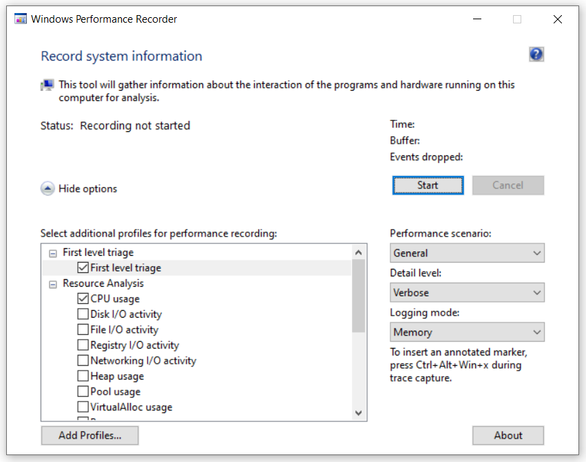

WPA is a tool that allows the user to visualize the event trace log (ETL) files generated by WPR, and perform analysis on the recorded applications.

.. important:: The user requires access to the corresponding symbols (PDB) of the application that is being profiled, as they are necessary for WPA to identify the function a process is in.
               PDB files are not shipped with AFSIM releases, but they can be generated if the source code is accessible.

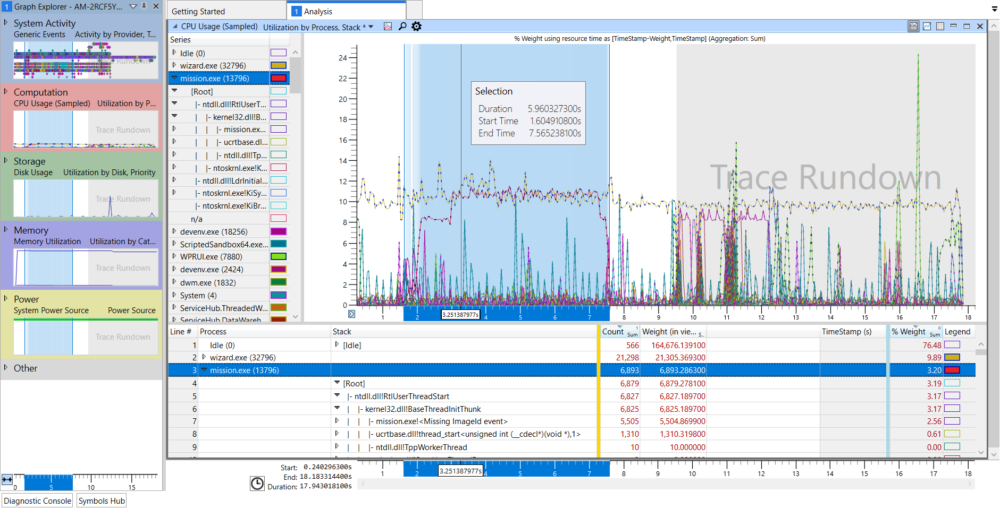

How to install WPR/WPA
----------------------

If Windows ADK is not installed on the testing machine, it can be obtained by going to the `download <https://docs.microsoft.com/en-us/windows-hardware/get-started/adk-install>`_ page and selecting the proper installer for the version of Windows being used.

The following are the system requirements for running Windows Performance Toolkit:
    - WPR : Windows 8 or later.
    - WPA : Windows 8 or later with the Microsoft .NET Framework 4.5 or later.

When running the install executable, the user should disable sending anonymous messages and select Windows Performance Toolkit, which contains WPR and WPA.

.. note:: Windows Performance Toolkit provides support for the previous command line tool, Xperf. However, Xperfview is no longer supported and all recordings using Xperf must be opened and analyzed by using WPA.

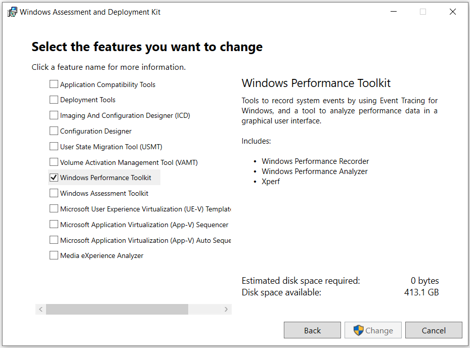
   
Once the installation is finished, the performance tools will be ready to begin performance testing.

How to use WPR
--------------
The WPR UI can be launched by typing "Windows Performance Recorder" into the taskbar search field or by finding it under Windows Kits when clicking the Start button.
Before starting a recording session, the user must configure WPR.
The following are recommended settings:

1. Set **Performance Scenario** to *General*

    - This sets WPR for general purpose recording while the computer is running.

2. Set **Detail Level** to *Verbose*

    - *Light* carries less overhead and interferes less with the systems; however, verbose recordings are more useful for thorough analysis.

3. Set **Logging**

    - Select *File* for short and targeted profiling sessions. This will record data into sequential files which will indefinitely grow, so a short session is recommended to avoid generating unnecessarily large files.
    - Select *Memory* for indeterminant profiling sessions; that is, the user can keep the recorder running until they detect something note-worthy or reach the exact point in the application they want to profile (i.e., launching *Mission* through the *Wizard* UI after loading a script). This will record data into a cyclical buffer that begins to drop the oldest events when the data size exceeds the buffer size.

    .. warning:: *File* mode can lead to recordings that are too big for WPA to open if the session runs for too long.

4. Select the **profiles**

    - *CPU Usage*
    - *Heap Usage* and *VirtualAlloc Usage* for memory profile

A more detailed description of the WPR features can be found in the `WPR documentation <https://docs.microsoft.com/en-us/windows-hardware/test/wpt/windows-performance-recorder>`_ page.

Once WPR is configured, the user can click on *Start* to begin the recording session which will capture **everything** that is running on the CPU.
At this point, the user can run the application that needs to be profiled (*Wizard*, *Mission*, etc.).
Clicking *Save* will stop the session and save the profile data; this will generate the event trace log.

WPR can also be run in the command prompt.
The performance tools require elevated privileges for use, so the user must run the command prompt as an **Administrator**.
Here is a sample command to begin profiling:

    ``wpr -start CPU.Verbose -recordtempto C:\<PATH>\wpr_test_temp``

This example command specifies that CPU usage will be recorded, and that the desired detail level will be set to *Verbose*.
A temporary directory must also be specified, for which WPR will use to store intermediate files when generating the resulting ETL.
To stop WPR and save the recording, use the command

    ``wpr -stop C:\<PATH>\test.etl "Description of problem" -skipPdbGen``

The path and file name must be specified, as does a description for the report.
The *skipPdbGen* flag tells WPR not to generate any cached symbols files.

For more information on how to use WPR via command line, the user can use the command

    ``wpr -help <option>``

or consult the `Microsoft Devblog <https://devblogs.microsoft.com/performance-diagnostics/wpr-start-and-stop-commands/>`_.

How to use WPA
--------------

The following is a brief example of how to look at a specific application (`mission.exe`) and analyze its CPU usage.

When WPA opens an ETL, the user will be presented with a blank Analysis tab and the Graph Explorer in the left pane.
The Graph Explorer contains all the recorded data based on performance profiles chosen.

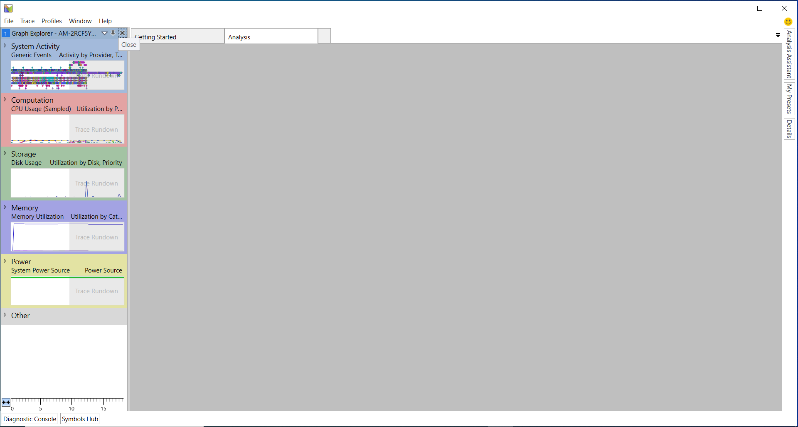

By double clicking on the graphs or dragging them into the Analysis tab, the user can view the recorded information.
The size of each information pane can be adjusted by clicking and dragging on the grey dividers.
This example depicts the CPU Usage (Sampled) graph which measures the aggregated dwell time of each function on the CPU.
The default sample rate is 1000 counts per second so each count is approximately 1 millisecond on the CPU.

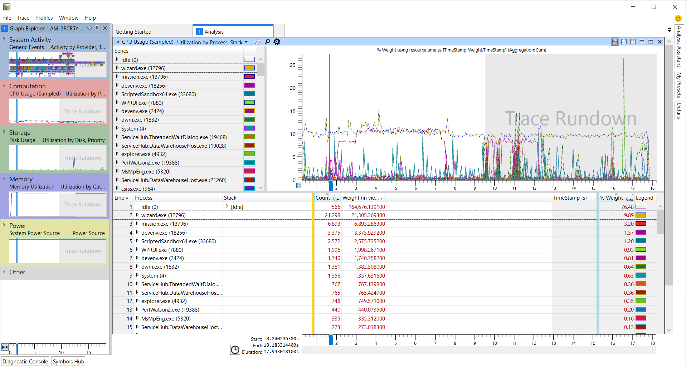

To isolate the output of a specific application (such as `mission.exe`), the user can filter out all other captured information by right-clicking on the target application and selecting *Disable > All but selection*.

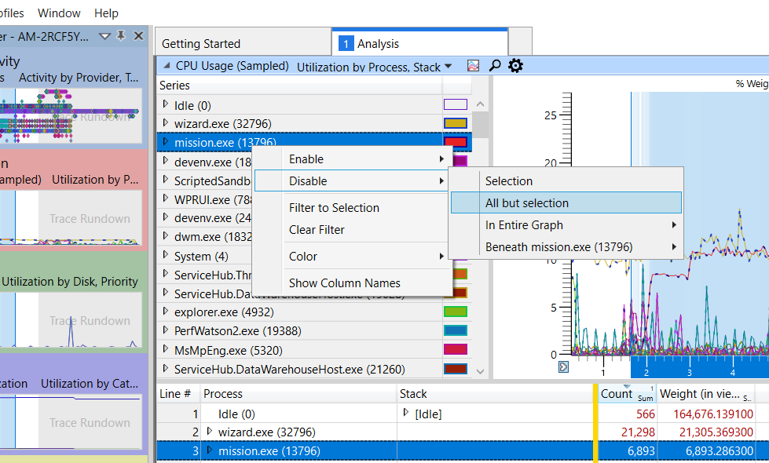

This will remove all other sampled processes from the graph window.
To isolate the application in the details window at the bottom, the user can right-click on it and select *Filter To Selection*.

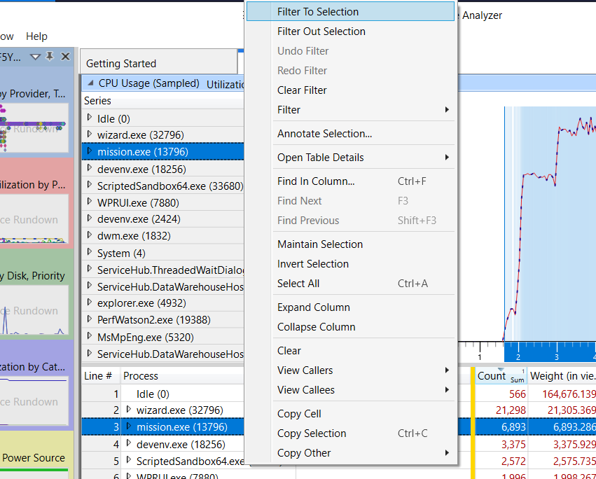

Resulting in WPA looking somewhat empty.

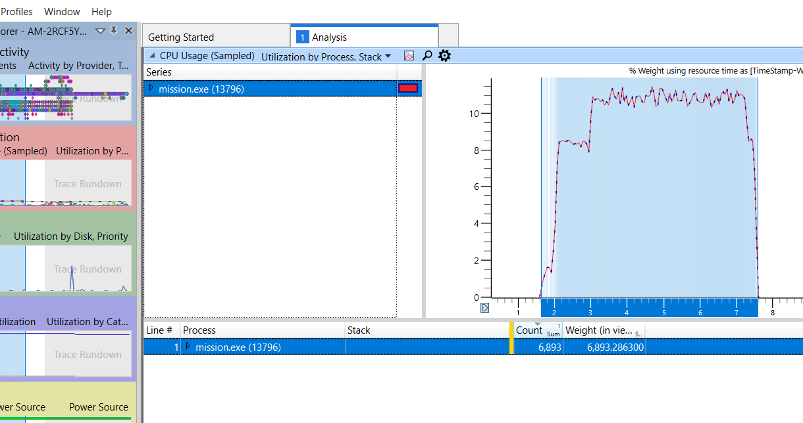

The user can begin navigating through the process tree by clicking the right-pointing triangles next to the process name and expanding the nodes.
The *Stack* column will begin to show the function stack of the process, which can be expanded in the same manner.
At this point, the user might see that the nodes under [Root] have the label

    ``<lib name>.dll!<Symbols disabled>``

This will occur if the symbols of the application have not been properly loaded into WPA.

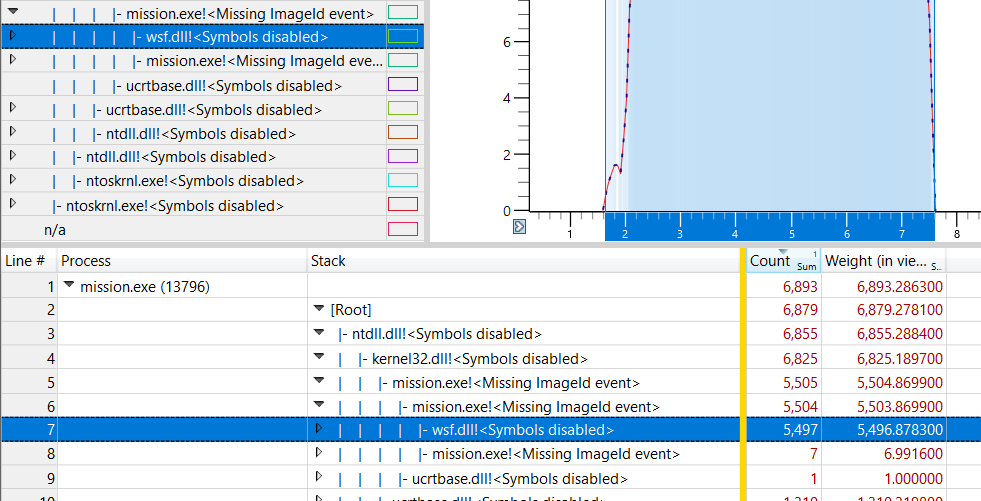

Loading Symbols
"""""""""""""""

To load symbols, the user will have to click on *Trace* in the upper-left menu of the WPA window and select *Configure Symbol Paths*.
This will open up the *Configure Symbols* menu that may contain pre-selected paths already enabled; depending on how WPR is configured, it will automatically generate and include cached symbols for other applications.
If the user is only concerned about AFSIM applications, they can remove the auto-generated paths and add the path to were the AFSIM PDB files reside.

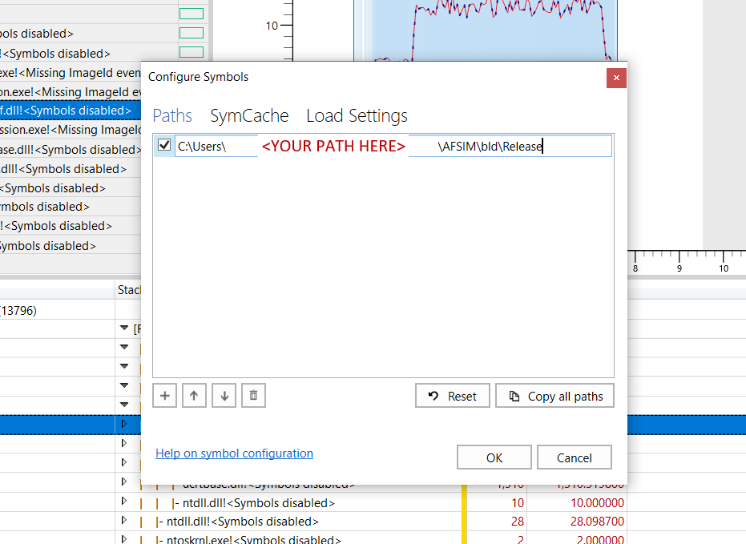

Once the path is added, the user should ensure the check mark field is enabled and click *OK*.
Next, *Trace* must be clicked again and the option *Load Symbols* selected.

.. note:: Enabling WPA symbol auto-loading aggregates symbol paths from previous sessions into the *Configure Symbols* menu, which may lead to redundancy and longer load times.

Now, when the user goes back to the details window, the nodes in the *Stack* column will properly identify the function names of the application.

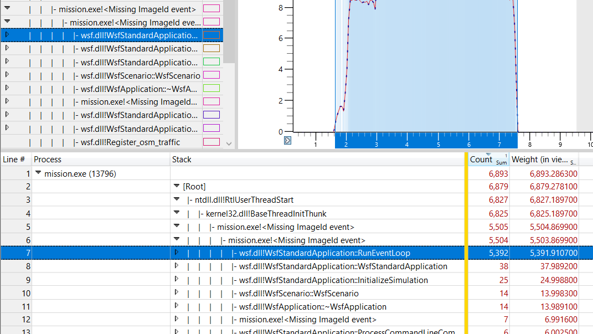

Analysis: Getting Started
-------------------------
WPA orders *Stack* nodes by largest sample count, which helps in identifying which function calls are taking the longest to complete.

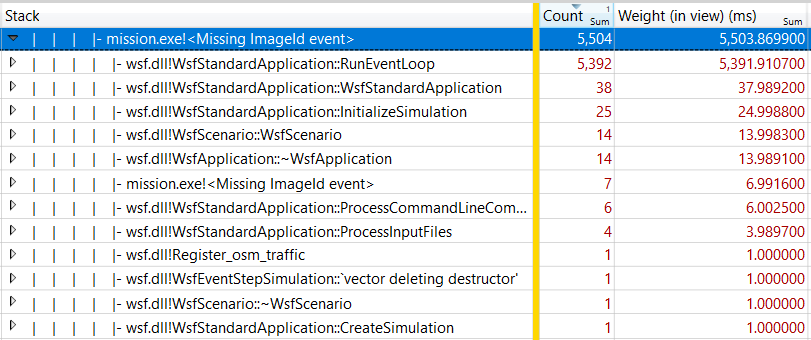

Sample count alone can be misleading as poorly performing functions may happen infrequently and may have small sample counts relative to the rest of the application; sample counts are aggregated values summed over the entire application's runtime.
In order to detect performance dips, the graph window can be utilized to inspect a specific interval of the runtime.
By clicking on the graph and dragging the cursor laterally, the user can select an interval to expand.

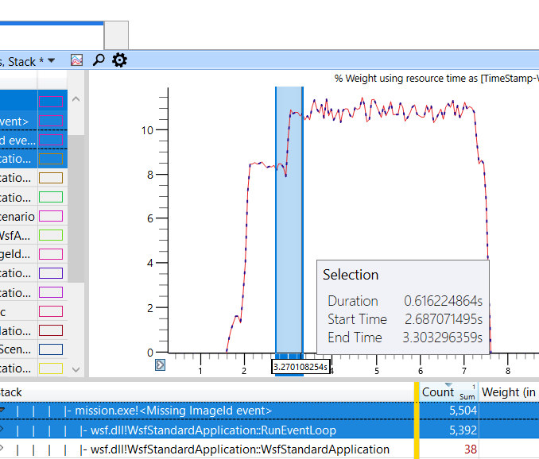

Right-clicking on a selected interval and clicking *Zoom* expands the interval to fill the graph window and updates the sample counts in the stack column to reflect which functions were most active in the selected interval.

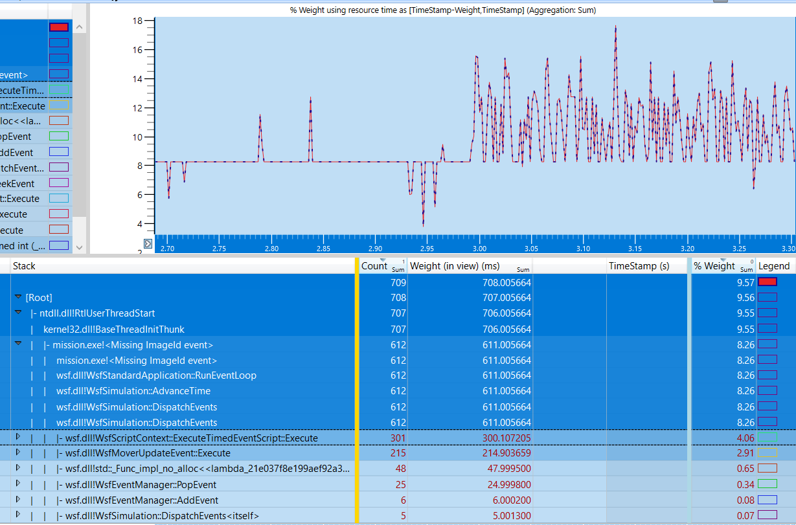

Additionally, the individual function calls can be selected to be drawn to the graph.
To enable this, the user can click on the corresponding squares in the *Legend* column.
The diagram below shows that the selected function calls, although having smaller sample counts relative to other siblings, are part of the reason for the sudden performance spikes in the graph.

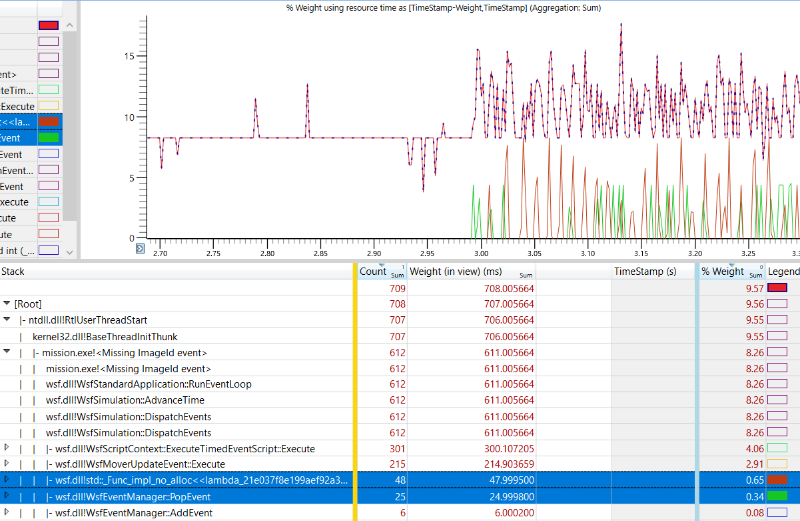

There are many analysis tools and features in WPA, from saving specific profile settings to filtering specific information.
Additional details on how to use WPA and its features can be found in the `WPA documentation <https://docs.microsoft.com/en-us/windows-hardware/test/wpt/windows-performance-analyzer>`_ page.

Bugs
----

In June 2021, Microsoft released a fix for a Windows Defender bug that was preventing WPR from generating the CPU Usage (Sampled) reports.
If WPA does not contain the sampled graph of a recording session, Windows Update will need to be run (possibly a few times) to fix the issue.

Unfortunately, this only fixes one of multiple issues Windows Defender is causing.
If the update does not fix the issue, a workaround is to temporarily disable **Real-time protection** in the **Windows Security** settings while running WPR, and re-enable it afterwards.