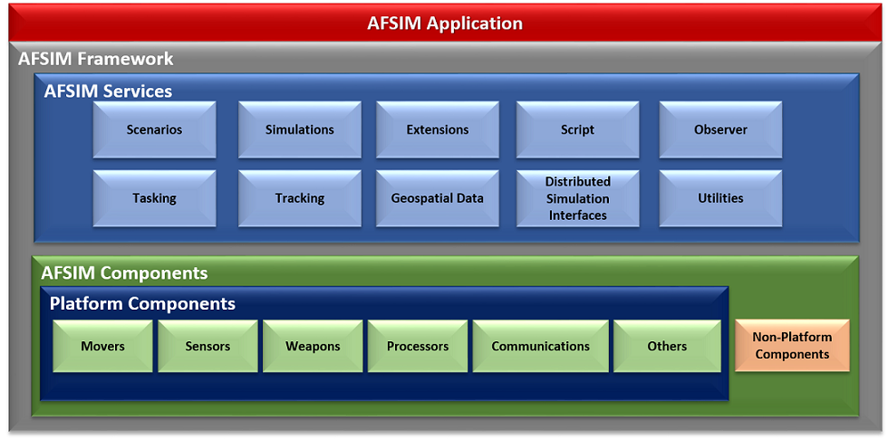
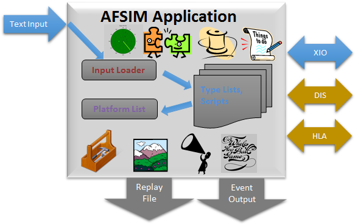
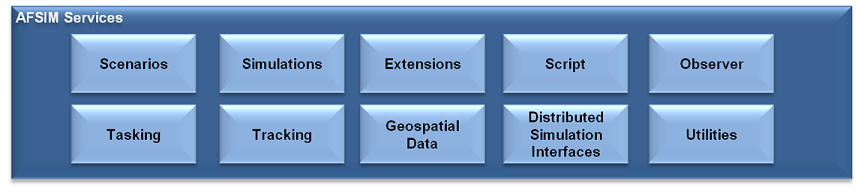
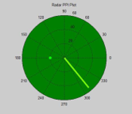
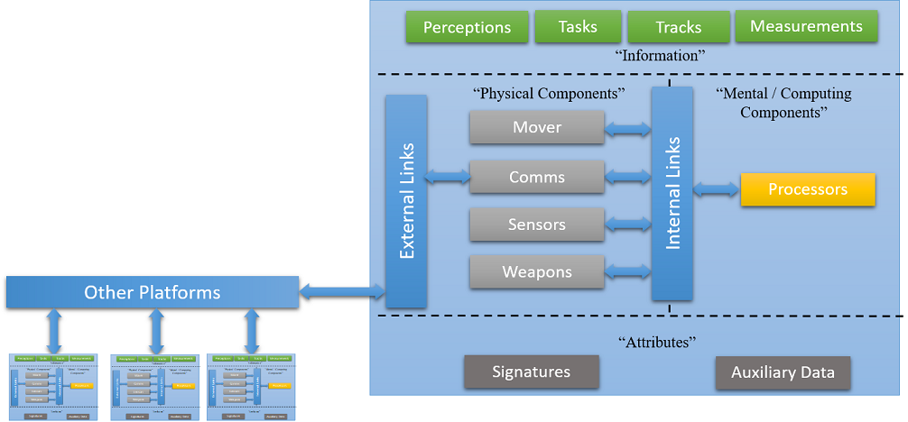

.. ****************************************************************************
.. CUI
..
.. The Advanced Framework for Simulation, Integration, and Modeling (AFSIM)
..
.. The use, dissemination or disclosure of data in this file is subject to
.. limitation or restriction. See accompanying README and LICENSE for details.
.. ****************************************************************************

*********************
Architecture Overview
*********************

.. contents:: Table of Contents
   :local:
   :depth: 4

Introduction
------------

This document describes an end-user view of the AFSIM architecture, it is meant for end-users to gain insight into the AFSIM operational concepts.

Core Architecture
-----------------

AFSIM's object-oriented C++ based architecture provides an extensible and modular architecture to allow for inclusion of many additional capabilities to be easily integrated. AFSIM allows new component models (e.g. sensors, communications, movers, etc.), as well as completely new component types to be inserted and utilized in the framework. Extensions and plug-ins are the primary mechanisms by which the framework is extended to integrate new platform component models, new and extended platform capabilities, and new and extended simulation services.   The plug-in capability is a form of extension that allows one to add capabilities without re-compiling the core AFSIM code. Use of plug-ins allows for easier distribution of extended capabilities and provide the ability to choose which extended capabilities to use for a given analysis. The following figure shows AFSIM primary framework components and services that are provided and may be extended.

Core Applications
-----------------

AFSIM-based executables generally consist of a single AFSIM "Application" that utilize AFSIM's services. This application maintains script types, extension and plug-in manager and application configuration data. The application is composed of one or more scenarios that own type factories and lists, user input, and scripts. The scenario is composed of one or more simulations, depending on the application. The simulation contains the type instances, interfaces (e.g. DIS, XIO, observer, terrain) and run-time data to include event management and threading.

Core Services
-------------

AFSIM provides capabilities for handling and supporting simulation execution and other routine computations and basic functions.

* **Scenarios** - Provide scenario input processing, type lists, and scripts.
* **Simulations** - Provide time-based event processing and maintain platform lists.
* **Thread Management** - Provides threading and multi-threading management capabilities.
* **Extensions and Plug-Ins** - Supply a generic method of adding new services and components.
* **Script** - Provides the infrastructure to implement and extend the AFSIM scripting language.
* **Observer** - Supplies a generic publish-subscribe service for extracting data from simulations.
* **Tasking** - Allows for inter-platform tasking and behavior modeling.
* **Tracking** - Allows for track formation from sensor measurements and track correlation and fusion.
* **Geospatial** - Data supplies terrain and line-of-sight data.
* **Distributed Simulation Interfaces** - Simulation Interfaces applies interface standards for simulation interoperability (IEEE 1278 & 1516).
* **Utilities** - Supply earth models, coordinate frames, math routines, artificial intelligence constructs, etc.

Scenarios
*********

Scenario Input Loader provides the mechanism for loading a simulation from input files. Scenario Type Lists and Scripts provide the internal representation of user input for AFSIM Components and scripts. There may be multiple scenarios in an application, although this is somewhat substandard.

Simulations
***********

Each Simulation maintains a platform list. A Simulation is instantiated from the scenario type lists in the ***scenario***. Simulations use time management to advance the state of the simulation in either a real-time or faster than real-time, i.e .constructive (as fast as possible) modes. Simulations own an Event Manager that is responsible for time-ordered processing of events. Although AFSIM is event-based, events are abstracted so that analysts don't have to worry about them. There may be multiple simulations per scenario.

Thread Management
*****************

Simulation thread management enables faster and more graceful simulation execution, especially in virtual real-time environments. Threading allows some processing to be performed in parallel, using separate threads of execution, e.g. sensor and mover updates, simulation interface and geospatial checks.

Extensions and Plug-Ins
***********************

   
**Extensions**
   Applications, scenarios, and simulations may all be "extended". Application extensions represent optional capabilities that can be added to an application. Scenario Extensions are used to register new component types and provide access to the input loader. Simulation Extensions provide simulation-specific optional capabilities and provide access to the observer service.

**Plug-Ins**
   Extension plug-in management allows development of extended AFSIM capabilities without changing the delivered framework code.

Utilities
*********

AFSIM Utilities provide a wide variety of software tools:

* Specialized data types
* Artificial intelligence constructs
* Mathematical classes and algorithms
* Input, output and file management routines
* Time management
* Earth coordinate reference frames and atmospheric data
* Publish / subscribe classes used by Observer Service
* Plus many others ...

Tasking
*******

Tasking is a service for sending and receiving ***task assignments** that are associated with tracks or perceptions. Tasking allows the user to categorize tracks using the concept of a finite state machine. The user defines a set of transition rules that define the conditions under which a transition can occur from one state to another. Each track maintains own state in AFSIM tasking.

Tracking
********

Provides Track Association, Track Filtering, and  Track Fusion. Native tracking algorithms are provided in AFSIM. Additionally 3rd party tracking algorithms may also be integrated. AFSIM currently supports:

* Perfect and Imperfect track correlation options.
* Several track filter choices.
* Covariance matrices provide detection & track probability regions.

Geospatial Data
***************

Terrain (Geospatial Data) Management Provides Optimized Terrain Elevation Lookup for both DTED and "float-grid" (ESRI-GIS compatible) Databases Line-of-Sight Management Provides a Service for Target Visibility Calculations

Observer
********

Observers allow data extraction without changes to the framework. The user can easily create "Script Observers" to extract data without software modifications using script type output. The observer can be used for standard and custom output, replay files and distributed interfaces.

Script
******

Script Manager understands script types and enables the scripting language. Script Types are easily extensible to accommodate newly integrated models and services.

Distributed Simulation Interfaces
*********************************

**DIS & HLA**
   AFSIM wrapped industry standard interfaces that allow platforms to interact with entities in other simulations.

**XIO**
   AFSIM special purpose interface that allows a simulation to be distributed among multiple computers and simulation control with graphical user interfaces.

Core Components
---------------

Platforms
*********

A Platform is a ***container*** for its constituent components. Platforms are Composed of:
* Physical Components
* Mental / Computing Components
* Information
* Attributes
* Links

Movers
******

A Mover is maintains the kinematic state (position, orientation, speed, acceleration, etc.) of the platform to which it is attached. Many options for movers are available that range from subsurface to space kinematic models.

Communications
**************

A communication device transmits and receives messages between platforms using external links. AFSIM allows for wired or wireless devices, using transmitters, receivers, and antennas to capture the full physical aspects of the communications systems.

Sensors
*******

A sensor creates measurements and transmits them over links in track messages. Sensors often utilize transmitters, receivers, and antennas in AFSIM. There are multiple options for radar propagation, extinction, clutter and errors in AFSIM.

Weapons
*******

A Weapon is something that is meant to prevent the operation of some other object (either permanently or temporarily). Most weapons are ***explicit*** weapons in AFSIM, where the object is explicitly modeled as a platform (e.g., missiles and bombs), in retrospect to ***implicit*** weapons that are not represented as platforms in the simulation (e.g. jammer or laser)

Processors
**********

A processor defines behaviors or computational algorithms much like a human brain or computer. Most processors are defined by the user using the AFSIM scripting language however, many special-purpose processors are provided by AFSIM.

Terminology
-----------

* **AFSIM** - Advanced Framework for Simulation, Integration and Modeling
* **COMMS** - Communications
* **DIS** - Distributed Interactive Simulation
* **HLA** - High-Level Architecture
* **WSF** - World Simulation Framework
* **XIO** - eXternal Input/Output

.. ITAR
